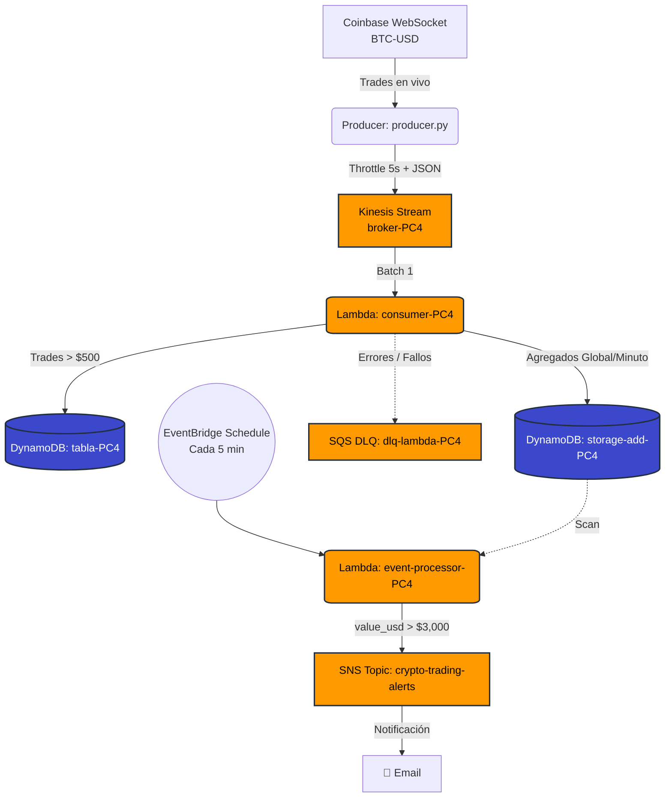

# PC4: Crypto Trading Pipeline — Arquitectura Basada en Eventos

## Descripción

Sistema de procesamiento de eventos de trading de criptomonedas en tiempo real usando arquitectura event-driven en AWS.

Ingesta datos reales de Coinbase WebSocket, los procesa asíncronamente con Lambda, mantiene estado derivado en DynamoDB (agregados globales + por minuto), maneja errores con DLQ y genera alertas automáticas mediante EventBridge + SNS.

> **Documentación completa:** Ver `docs/PC4_Documentacion.docx` para la explicación detallada con capturas de ejecución, decisiones técnicas, patrones EDA demostrados y checklist de requisitos cumplidos.

---

## Arquitectura



---

## Requisitos PC4 Cumplidos

| Requisito | Implementación | Estado |
|---|---|---|
| Generación de eventos | Producer Coinbase WebSocket (trades reales) | ✅ |
| Ingesta y canalización | Kinesis Stream (broker-PC4, ON_DEMAND) | ✅ |
| Procesamiento asíncrono | Lambda consumer-PC4 (batch=1) | ✅ |
| Estado y agregados | storage-add-PC4 (global + ventanas por minuto, incrementales) | ✅ |
| Persistencia | 2 tablas DynamoDB + SQS | ✅ |
| Manejo de errores | SQS DLQ + try-catch + reintentos Kinesis | ✅ |

---

## Patrones Event-Driven Demostrados

| Patrón | Cómo se demuestra |
|---|---|
| **Pub/Sub Asincrónico** | Producer y Consumer completamente desacoplados vía Kinesis |
| **Streaming con Particiones** | Kinesis particionado por símbolo, orden garantizado |
| **Estado Derivado Incremental** | Cada evento actualiza agregados (+=), no recalcula |
| **Ventanas Temporales** | Agregados globales + agregados por minuto (windowing) |
| **Retry + DLQ** | Lambda reintenta 3 veces, batch fallido → SQS DLQ |
| **Idempotencia** | PK+SK en DynamoDB garantiza sin duplicados |

---

## Estructura del Repositorio

```
PC4-AWS/
├── README.md                          ← Este archivo
├── docs/
│   └── PC4_Documentacion.docx         ← Documentación completa con capturas
├── producer/
│   └── producer.py                    ← Coinbase WebSocket → Kinesis
├── lambda/
│   ├── consumer.py                    ← Kinesis → DynamoDB + SQS
│   └── event_processor.py            ← EventBridge → SNS alertas
└── terraform/
    ├── main.tf                        ← IaC completa (Kinesis, DynamoDB, Lambda, SQS, SNS, EventBridge, IAM)
    └── terraform.tfvars               ← Variables (email, región, LabRole ARN)
```

---

## Componentes

### Producer (`producer/producer.py`)
- **Fuente:** Coinbase WebSocket pública (sin API key)
- **Proceso:** Lee trades en vivo → Transforma a JSON → Envía a Kinesis
- **Throttle:** 1 trade cada 5 segundos (configurable)
- **Ejecución:** `python producer.py`

### Consumer Lambda (`lambda/consumer.py`)
- **Trigger:** Kinesis stream broker-PC4
- **Filtro:** Guarda trades > $500 USD en tabla-PC4
- **Agregados:** Actualiza storage-add-PC4 con TODOS los trades (global + por minuto)
- **Errores:** Simulados al 20%, capturados → SQS DLQ

### Event Processor Lambda (`lambda/event_processor.py`)
- **Trigger:** EventBridge Schedule (cada 5 minutos)
- **Proceso:** Scan de storage-add-PC4, filtra value_usd > $3.000
- **Salida:** Publica a SNS Topic → Email de alerta

### DynamoDB
- **tabla-PC4:** Trades filtrados (PK=symbol, SK=exchange_ts). Solo > $500.
- **storage-add-PC4:** Agregados de TODOS los trades. Global (PK=symbol) + por minuto (PK=symbol#HH:MM).

### Kinesis
- **Stream:** broker-PC4 (ON_DEMAND, particionado por símbolo, 24h retención)

### SQS
- **Queue:** dlq-lambda-PC4 (Dead Letter Queue para errores)

### SNS + EventBridge
- **Topic:** crypto-trading-alerts (suscripción email)
- **Rule:** large-trade-alert (cada 5 minutos → Lambda event-processor)

---

## Decisiones Técnicas

**Kinesis vs SQS:** Necesitamos streaming real-time con orden garantizado por símbolo y capacidad de replay (24h). SQS no garantiza orden.

**DynamoDB vs RDS:** No necesitamos SQL complejo. DynamoDB escala automáticamente (ON_DEMAND) y las operaciones son simples (sum, count).

**Agregados incrementales vs recalculados:** Cada evento hace += (O(1)) en lugar de recalcular desde cero (O(n)).

**EventBridge para alertas:** Simple y suficiente para alertas periódicas. DynamoDB Streams añadiría complejidad innecesaria.

**Batch Size = 1:** Configuración actual para demostración. En producción se ajustaría según volumen (batch 20-500).

---

## Cómo Ejecutar

### Requisitos
- Cuenta AWS
- Python 3.11+
- AWS CLI configurado

### 1. Infraestructura

**Opción A: Con Terraform (recomendado)**

El archivo `terraform/main.tf` despliega TODA la arquitectura automáticamente: Kinesis, DynamoDB (2 tablas), Lambda (2 funciones), SQS, SNS, EventBridge y los roles IAM necesarios.

```bash
cd terraform/

# Editar terraform.tfvars con tu email y LabRole ARN
vim terraform.tfvars

terraform init
terraform apply
```

> **Nota:** Si usas cuenta de laboratorio con LabRole, configurar `lab_role_arn` en `terraform.tfvars`. Si no, dejarlo vacío y Terraform creará los roles.

Tras el `apply`, confirmar la suscripción SNS haciendo clic en el enlace que llega por email.

**Opción B: Manual en AWS Console**

Crear manualmente en este orden:
1. Kinesis Stream `broker-PC4` (ON_DEMAND)
2. DynamoDB `tabla-PC4` (PK=symbol, SK=exchange_ts)
3. DynamoDB `storage-add-PC4` (PK=symbol)
4. SQS `dlq-lambda-PC4`
5. Lambda `consumer-PC4` (subir `lambda/consumer.py`)
6. Event Source Mapping: Kinesis → Lambda consumer (batch=1)
7. SNS Topic `crypto-trading-alerts` + suscribir email
8. Lambda `event-processor-PC4` (subir `lambda/event_processor.py`)
9. EventBridge Schedule `large-trade-alert` (rate 5 minutes) → Lambda event-processor

### 2. Desplegar Lambdas
- Subir `lambda/consumer.py` a Lambda consumer-PC4
- Subir `lambda/event_processor.py` a Lambda event-processor-PC4

### 3. Iniciar Producer
```bash
python producer/producer.py
```

### 4. Monitorear
```bash
# DynamoDB
aws dynamodb scan --table-name storage-add-PC4 --limit 10

# SQS (errores)
aws sqs receive-message --queue-url https://sqs.us-east-1.amazonaws.com/.../dlq-lambda-PC4

# Lambda Logs
aws logs tail /aws/lambda/consumer-PC4 --follow
```
